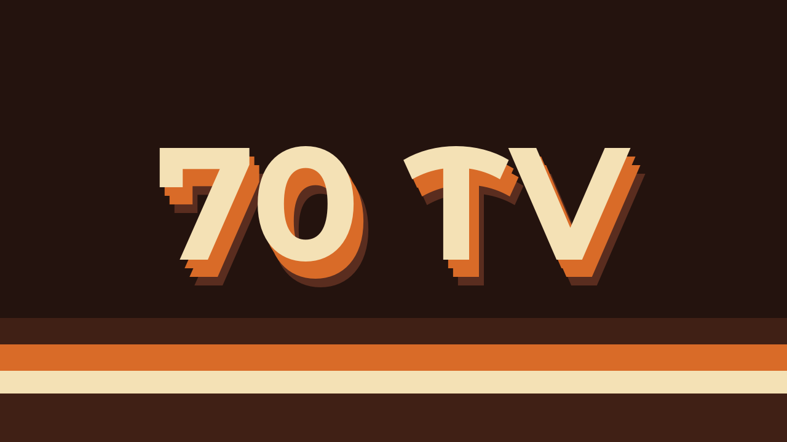

# 70 TV

Título Fusion reutilizable para **DaVinci Resolve 21**, inspirado en la gráfica televisiva de los años setenta.

[](LICENSE)
[](https://www.blackmagicdesign.com/products/davinciresolve)
[](https://github.com/pacoestrada/70-tv-fusion-title/actions/workflows/validate.yml)



> La imagen utiliza un fondo de presentación para mostrar el diseño. El título instalado tiene fondo transparente.

## Descarga rápida

- [Descargar la última versión](https://github.com/pacoestrada/70-tv-fusion-title/releases/latest)
- [Descargar directamente `70 TV.drfx`](dist/70%20TV.drfx)
- [Ver el macro fuente `70 TV.setting`](src/70%20TV.setting)

## Qué incluye

- Tipografía gruesa y geométrica con personalidad retro.
- Paleta crema, naranja y marrón completamente editable.
- Extrusión escalonada de varias capas.
- Separación ligera entre caracteres.
- Entrada suave de 18 fotogramas.
- Overshoot breve al 105,5 % antes de asentarse al 100 %.
- Fondo transparente.
- Miniatura propia en la Biblioteca de efectos.
- Controles simplificados en el Inspector.
- `Keyframe Stretcher` para conservar la entrada al cambiar la duración del clip.

## Controles del Inspector

| Control | Función |
| --- | --- |
| Texto principal | Cambia el contenido del título. |
| Tipografía | Selecciona cualquier familia instalada. |
| Estilo | Cambia el peso o variante disponible. |
| Tamaño | Ajusta el tamaño del texto sin alterar la animación. |
| Separación | Controla el espacio entre caracteres. |
| Posición | Mueve el título completo. |
| Color crema | Color de la cara frontal. |
| Color naranja | Color de las capas intermedias de la extrusión. |
| Color marrón | Color de la capa profunda o sombra. |

## Instalación recomendada (`.drfx`)

1. Descarga `70 TV.drfx` desde la sección [Releases](https://github.com/pacoestrada/70-tv-fusion-title/releases/latest).
2. Abre DaVinci Resolve y entra en cualquier proyecto.
3. Ve a la página **Fusion**.
4. Arrastra `70 TV.drfx` desde el gestor de archivos hasta la página Fusion.
5. Confirma la instalación del paquete.
6. Ve a **Editar → Biblioteca de efectos → Títulos**.
7. Busca **70 TV** y arrástralo a la línea de tiempo.

También puedes hacer doble clic sobre el archivo `.drfx`. Si Linux no tiene asociada la extensión con Resolve, utiliza el método de arrastrar el archivo a la página Fusion.

## Instalación manual (`.setting`)

Desde Resolve:

1. Abre **Fusion → Biblioteca de efectos**.
2. Entra en **Templates → Edit → Titles**.
3. Abre el menú de tres puntos y selecciona **Show Folder / Mostrar carpeta**.
4. Copia allí [`src/70 TV.setting`](src/70%20TV.setting).
5. Reinicia Resolve.

Ruta exacta del usuario en Linux:

```text
~/.local/share/DaVinciResolve/Fusion/Templates/Edit/Titles/
```

Los nombres `Fusion`, `Templates`, `Edit` y `Titles` distinguen entre mayúsculas y minúsculas.

## Tipografía

El título utiliza **Montserrat Alternates Bold** por defecto. La fuente no se redistribuye dentro del paquete. Montserrat está publicada bajo la [SIL Open Font License 1.1](https://github.com/JulietaUla/Montserrat/blob/master/OFL.txt) y puede obtenerse desde [Google Fonts](https://fonts.google.com/specimen/Montserrat+Alternates).

Si la fuente no está instalada, selecciona otra tipografía pesada desde el Inspector. El diseño no depende de archivos externos para funcionar.

## Cómo funciona

El macro genera una única máscara de texto y la reutiliza para construir cuatro niveles visuales:

```text
TextMask
  ├─ CreamColor ───────────────────────────────┐
  ├─ OrangeStep1 ─┐                            │
  ├─ OrangeStep2 ─┼─ OrangeColor ─┐            │
  ├─ OrangeStep3 ─┘               ├─ Merge ────┼─ EntryTransform ─ KeyStretcher
  └─ BrownStep ───── BrownColor ──┘            │
                                               ┘
```

La escala de entrada usa tres claves:

| Fotograma | Escala |
| ---: | ---: |
| 0 | 82 % |
| 11 | 105,5 % |
| 18 | 100 % |

La opacidad pasa de 0 a 100 % durante los primeros 12 fotogramas. El `Keyframe Stretcher` mantiene intactos los 18 fotogramas de entrada aunque se alargue el título en la línea de tiempo.

Más detalles en [Arquitectura](docs/ARCHITECTURE.md).

## Compatibilidad

- Verificado en **DaVinci Resolve Studio 21.0.3 para Linux**.
- Construido exclusivamente con herramientas Fusion estándar: `TextPlus`, `Transform`, `Background`, `Merge`, `BezierSpline` y `KeyStretcher`.
- No utiliza plugins, fuentes incrustadas, LUT, vídeo, audio ni imágenes externas.
- La estructura `.drfx` sigue la jerarquía `Edit/Titles` reconocida por Resolve.

Debería funcionar en las ediciones Free y Studio de Resolve 21 y en otros sistemas compatibles, pero la validación directa de esta versión se realizó en Resolve Studio 21.0.3 para Linux.

## Validación

La versión publicada pasa las siguientes comprobaciones:

1. El parser Lua integrado en Fusion 21 acepta el `.setting`.
2. `bmd.readfile` carga la tabla de ajustes, la macro `TV70` y su grafo interno.
3. Las 16 referencias `SourceOp` apuntan a herramientas existentes.
4. Los controles del Inspector y las claves de overshoot están presentes.
5. El `.drfx` es un ZIP íntegro con la estructura `Edit/Titles`.
6. El `.setting` incluido en el `.drfx` coincide byte a byte con el archivo de `src/`.

GitHub Actions repite automáticamente las comprobaciones portables en cada cambio. Consulta [VALIDATION.md](VALIDATION.md) para ver el alcance exacto.

## Estructura del repositorio

```text
.
├── dist/
│   └── 70 TV.drfx
├── docs/
│   ├── 70-TV-preview.png
│   └── ARCHITECTURE.md
├── src/
│   └── 70 TV.setting
├── tools/
│   └── validate_release.py
├── CHANGELOG.md
├── CONTRIBUTING.md
├── LICENSE
├── THIRD_PARTY_NOTICES.md
└── VALIDATION.md
```

## Crear el `.drfx` desde el código fuente

Un archivo `.drfx` es un ZIP con extensión renombrada. La ruta interna del título debe ser:

```text
Edit/Titles/70 TV.setting
```

El paquete de `dist/` añade también las miniaturas `70 TV.wide.png` y `70 TV.wide@2x.png`.

## Autoría y licencia

Diseño, dirección y publicación: **Paco Estrada**.

Implementación y documentación desarrolladas con ayuda de OpenAI Codex. El resultado se publica bajo la [licencia MIT](LICENSE). Consulta [THIRD_PARTY_NOTICES.md](THIRD_PARTY_NOTICES.md) para las atribuciones y la nota de marcas.

Este es un proyecto comunitario independiente. **DaVinci Resolve** y **Blackmagic Design** son marcas de Blackmagic Design Pty. Ltd. El proyecto no está afiliado, patrocinado ni aprobado por Blackmagic Design.

## Idiomas

- Español: este documento.
- [English](README.en.md)

